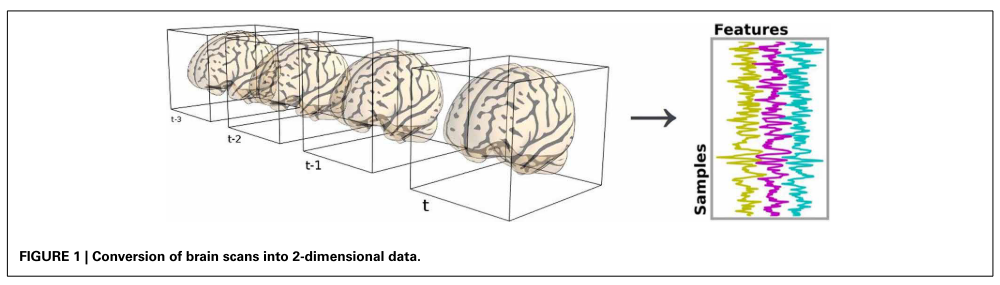

# fmri-machine-learning
Learning/teaching materials on applying machine learning algorithms to fMRI data.

**What is machine learning (ML)?**

The art and science of giving computers the ability to learn to make decisions from data, without being explicitly programmed (DataCamp definition).

**How we can apply ML algorithms on fMRI data?**

With fMRI technique, we can scan the human brain multiple times during performing some activity (e.g. task, rest, or sleep). Resulting brain images are stored in 4D arrays, where the first three dimensions are reserved for 3D brain image (so-called *volume*), while remaining the fourth dimension represents time-point (one complete volume of the brain is acquired every 1-2 seconds), covering the whole scan time (usually 10-60 min).

Each brain volume includes thousands of voxels (3D pixels, commonly 1 mm3 each). For the purpose of running machine learning algorithms on fMRI data, we have to convert our 4D fMRI data into a 2D array of features. To reduce the number of features, we can extract the brain activity from meaningful brain atlases, also known as *brain parcellation*. For the instruction on how to extract time-series from brain parcellation check out this Nilearn [tutorial](https://nilearn.github.io/connectivity/functional_connectomes.html). 

In general, we need something like this:

Figure from Abraham et al. (2014) *Frontiers in Neuroinformatics* paper.

In this machine learning training materials, I use previously prepared fMRI time-series extracted from the task and resting-state data using [Schaefer](https://github.com/ThomasYeoLab/CBIG/tree/master/stable_projects/brain_parcellation/Schaefer2018_LocalGlobal) parcellation. I extracted time-series from data of 10 subjects and concatenated them to obtain a long 2D array. 

In folder `data` you can find:
* prepared and concatenated fMRI time-series for task and rest (`concat_10subjects_timeseries_shaefer400_pipeline-24HMP_8Phys_SpikeReg_4GS.npy`)
* table with labels for task conditions (`task_conditions.csv`)

**Types of ML algorithms:**

1. *supervised learning* - predicting the target variable, given the predictor variables (labeled data) 

    * *classification* - target variable consists of categories (for exampple automating diagnosis)
    * *regression* - target variable is continous (for example predicting future)
    
2. *unsupervised learning* - uncovering hidden structures and patterns (unlabeled data)

    * *clustering* - grouping data points into distinct categories (for example fMRI timeseries into distinct brain states)
    
3. *reinforcement learning* - software agents interacts with an environment, learning how to optimize their behavior given a system of rewards and punishments. Draws inspiration from behavioral psychology. Has applications in. Applications: economics, genetics, game playing (AlphaGo).

**Python libraries:**

1.  scikit-learn/sklearn - all ML learning models implementeas Python classes, which implement the algorithms for learning and predicting + storing all the information learned from the data.
    * `.fit()` method for training a model on the data = "fitting" a model to the data
    * `predict()` method for predicting the labels of new data    

- TensorFlow
- keras

